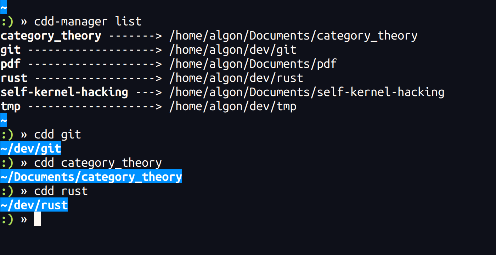

# cdd

*Change Directory Directly*

## Demo



## Features

- jump to your favorite directory in a moment (wherever you are)
- bash scripts
- autocompletion supported

## Requirement

- bash

## Installation

1. Copy `cdd.sh` and `cdd-manager.sh` somewhere (suppose they are in `path/to/scripts`).
```
$ cp cdd.sh cdd-manager.sh path/to/scripts
```

2. Add following lines to your `.bashrc`.
```sh
source path/to/scripts/cdd.sh
source path/to/scripts/cdd-manager.sh
```

3. (OPTIONAL) Edit `CDD_DIR` in `cdd.sh`.
    - `$CDD_DIR` is used for registered symbolic links.
    - Its default value is `$HOME/.cdd`.
    - If the directory doesn't exist, it will be made automatically when the script is loaded.

## Usage

```
Usage:
    cdd-manager add <target-directory> [<link-name>]
    cdd-manager remove <link-name>
    cdd-manager list
```

### Register

##### using cdd-manager
```
$ cdd-manager add path/to/target/directory your_favorite_name
```
4th argument is optional (if it is omitted, basename of the directory is used)

##### manually
You can also register a directory manually.
(In fact, the above command is just creating a symbolic link to the target directory.)
```
$ ln -s /full/path/to/target/directory ${CDD_DIR}/your_favorite_name
```

### Jump
```
$ cdd your_favorite_name
```

### Remove
##### using cdd-manager
```
$ cdd-manager remove your_favorite_name
```

##### manually
Just remove corresponding symbolic links.
```
$ rm ${CDD_DIR}/your_favorite_name
```

### Show list of the registered directories
```
$ cdd-manager list
your_favorite_name --> /full/path/to/target/directory
```

